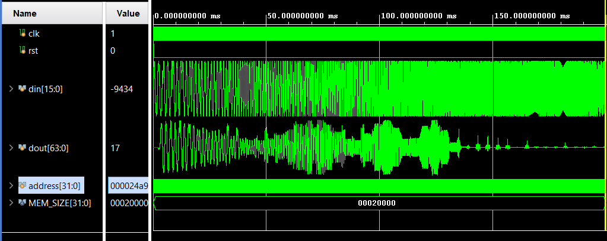
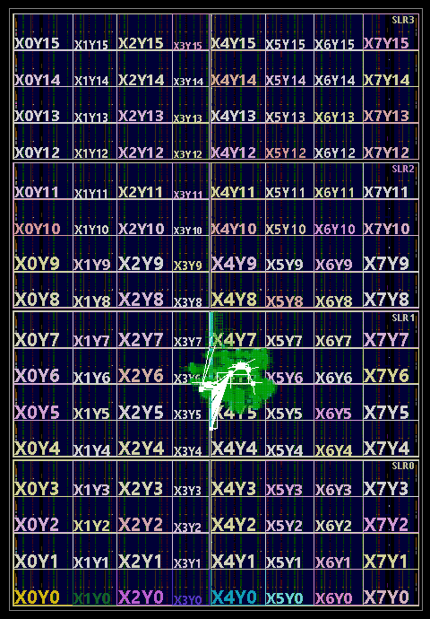

# Pipelined FIR Filter Optimization Project

## Highlights
- Designed 4 FIR filters using SystemVerilog using parallelism and pipelining
- Simulated and synthesized filters in Vivado to perform power and area analysis
- Used MATLAB filterDesigner to acquire filter coefficients

## MATLAB Filter Design
The goal of the project was to design a 102-tap low-pass filter with the transition region of 0.2pi-0.23pi radians/sample and stopband attenuation of at least 80dB. To acquire the coefficients, I used the MATLAB Filter Designer Tool, which can be launched in MATLAB with the command `filterDesigner`. Then, we construct the filter as shown below.

|  |
|:--:|
| *Figure 1: MATLAB filter response* |

There are a few things of note.
1. The filter has a sampling frequency of 47 kHz. This can be set by right clicking the plot and entering the configuration as shown below in Figure 2.
2. Instead of showing the radians/sample in the plot, we can opt to show the frequency instead. We can configure this by right clicking the x-axis and choosing the options shown in Figure 2.
3. There is significant dB loss after ~5 Khz.
4. The quantized and reference responses are nearly identical. This is because I used 32 bit coefficients, with 31 bits allocated to the fraction. This allows near perfect performance from the quantized filter.

|  |
|:--:|
| *Figure 2: Setting sampling frequency* |

|  |
|:--:|
| *Figure 3: Show frequency on plot* |

After the filter has been designed, the coefficients must be extracted. This can be done by selecting `Targets-->Generate C header...`. We can then make the selections shown below in Figure 4, and save the results to [fdacoefs.h](fdacoefs.h)

After that, we paste the results into [coefs.py](coefs.py). Running the script will then output the coefficients line by line in signed binary. After adding the proper SystemVerilog tags, we can place the coefficients into the code as shown below.

    logic signed [31:0] coef [TAPS-1:0];

    initial begin
        coef = '{
            32'b11111111111110000101000100011100,
            32'b11111111111000110010100001001110,
            ....
        };

Since these coefficients are created by increasing the magnitude of the original values, we must account for this by shifting the output of our filters right by 31 digits.

## Simulation Inputs
We can generate the inputs for the testbench files by using a simple python script. The code written in [generate_sin.py](generate_sin.py) generates 50 signals with frequencies increasing logarithmically from 500 to 20000. This allows us to generate a frequency response graph similar to the one shown above from MATLAB. Running this file saves the configured data to `input.data`.

## Pipelined FIR Filter
### Design
To design the pipelined FIR filter, we first start with the standard design shown below, and add delay registers via pipelining. Each red line indicates a pipelining operation, and there should be one between each stage. This will reduce our critical path to one adder and one multiplier, instead of 1 multiplier and N-1 adders.
|  |
|:--:|
| *Figure 4: Pipelined FIR diagram* |

By reducing the number of coefficients to 3, we can generate the elaborated schematic from Vivado shown below. This has been provided to illustrate the additional pipeline registers within the RTL code. Observe that the adder chain has been broken up by registers, reducing the critical path.

|  |
|:--:|
| *Figure 5: Simplified version of filter with 3 coefficients* |

### Vivado Setup
All analysis was done using Xilinx Vivado. Each filter has its own project, but the Source setup is relatively the same. Unless specified, the project includes one top sv file, one data input file, and one testbench file. This is shown below for the pipelined FIR filter.

|  |
|:--:|
| *Figure 6: Vivado RTL project sources* |

### Behavioral Simulation
We first confirm functionality of the filter using the simulation. As shown below in Figure 7, we see the same oscillation in the pass band as in the MATLAB filter. Then, we see a sharp cutoff region as the logarithmically increasing frequency of din becomes too high.

|  |
|:--:|
| *Figure 7: Vivado simulation results* |

### Timing Analysis
Next, we perform timing analysis to find the critical path. We can generate the shortest path by running `report_timing -max_paths 1 -path_type full -delay_type max` in the tcl console. This produces the below output.

    Location             Delay type                Incr(ns)  Path(ns)    Netlist Resource(s)
    -------------------------------------------------------------------    -------------------
                         (clock clk rise edge)        0.000     0.000 r  
                         propagated clock network latency
                                                      4.365     4.365    
    SLICE_X13Y16         FDRE                         0.000     4.365 r  acc_pipe_reg[101][63]/C
    SLICE_X13Y16         FDRE (Prop_fdre_C_Q)         0.269     4.634 r  acc_pipe_reg[101][63]/Q
                         net (fo=1, routed)           3.312     7.946    dout_OBUF[31]
    E22                  OBUF (Prop_obuf_I_O)         2.512    10.458 r  dout_OBUF[63]_inst/O
                         net (fo=0)                   0.000    10.458    dout[63]
    E22                                                               r  dout[63] (OUT)
    -------------------------------------------------------------------    -------------------
                         (clock clk rise edge)    21276.000 21276.000 r  
                         propagated clock network latency
                                                      0.000 21276.000    
                         clock pessimism              0.000 21276.000    
                         clock uncertainty           -0.035 21275.965    
                         output delay              -100.000 21175.965    
    -------------------------------------------------------------------
                         required time                      21175.965    
                         arrival time                         -10.458    
    -------------------------------------------------------------------
                         slack                              21165.508

With this information, we know that the critical path is `acc_pipe_reg[101]` to `dout`. This connection is the shift operation that converts `dout` back to the appropriate magnitude by accounting for the raised coefficients. Further, we can glean the following information.

1. The minimum delay in this circuit is the arrival time. In other words, the critical path is 10.458 ns.
2. The max clock frequency can thus be calculated as the inverse of the arrival time, or 95.61 MHz.
3. There is an extreme amount of slack in this circuit. My clock is running much, much slower (47 kHz) than it could (95.61 MHz).

|  |
|:--:|
| *Figure 8: Critical path created by shift* |

### Utilization and Power
Next, we run implementation. Doing this grants access to utilization and power characteristics, which are shown below.

|  |
|:--:|
| *Figure 9: Post-implementation utilization and power* |

## Two-Parallel FIR Filter
### Design
To design the Two-Parallel FIR filter, I followed the diagram provided in Parhi's slides [1]. Since there is no pipelining, this is a more simple process. Parallel FIR filters use poly-phase decomposition, and I highly recommend the reader view Parhi's slides for a quick discussion on H1, H2, and any other aspects of this filter that could be confusing. Additionally, this design is a "fast" version, meaning that the filter has been reformulated to minimize the number of operations required.
|  |
|:--:|
| *Figure 10: Two-Parallel FIR diagram [1]* |

### Behavioral Simulation
Again, the simulation results match MATLAB.
|  |
|:--:|
| *Figure 11: Vivado simulation results* |

### Timing Analysis
We again perform timing analysis to determine the critical path.

    Timing Report

    Slack (MET) :             21145.209ns  (required time - arrival time)
    Source:                 buffer2_reg[38][4]/C
                                (rising edge-triggered cell FDCE clocked by clk  {rise@0.000ns fall@10638.000ns period=21276.000ns})
    Destination:            dout2[62]
                                (output port clocked by clk  {rise@0.000ns fall@10638.000ns period=21276.000ns})
    Path Group:             clk
    Path Type:              Max at Slow Process Corner
    Requirement:            21276.000ns  (clk rise@21276.000ns - clk rise@0.000ns)
    Data Path Delay:        26.063ns  (logic 11.524ns (44.217%)  route 14.539ns (55.783%))
    Logic Levels:           31  (CARRY4=19 DSP48E1=2 LUT2=1 LUT3=3 LUT4=3 LUT5=1 LUT6=1 OBUF=1)
    Output Delay:           100.000ns
    Clock Path Skew:        -4.693ns (DCD - SCD + CPR)
        Destination Clock Delay (DCD):    0.000ns = ( 21276.000 - 21276.000 ) 
        Source Clock Delay      (SCD):    4.693ns
        Clock Pessimism Removal (CPR):    0.000ns
    Clock Uncertainty:      0.035ns  ((TSJ^2 + TIJ^2)^1/2 + DJ) / 2 + PE
        Total System Jitter     (TSJ):    0.071ns
        Total Input Jitter      (TIJ):    0.000ns
        Discrete Jitter          (DJ):    0.000ns
        Phase Error              (PE):    0.000ns
    < Omitted calculations >
    -------------------------------------------------------------------    -------------------
                         (clock clk rise edge)    21276.000 21276.000 r  
                         propagated clock network latency
                                                      0.000 21276.000    
                         clock pessimism              0.000 21276.000    
                         clock uncertainty           -0.035 21275.965    
                         output delay              -100.000 21175.965    
    -------------------------------------------------------------------
                         required time                      21175.965    
                         arrival time                         -30.756    
    -------------------------------------------------------------------
                         slack                              21145.209 

We can again derive a few key facts:
1. The critical path is 30.756 ns.
2. The max clock frequency is 32.51 MHz.
3. There is an extreme amount of slack in this circuit. My clock is running much, much slower (47 kHz) than it could (32.51 MHz).

|  |
|:--:|
| *Figure 12: Critical path created by shift* |

### Utilization and Power

|  |
|:--:|
| *Figure 13: Post-implementation utilization and power* |

## Three-Parallel FIR Filter
### Design
I again used Parhi's slides to make the Fast Three-Parallel FIR Filter.
|  |
|:--:|
| *Figure 14: Two-Parallel FIR diagram [1]* |

### Behavioral Simulation
Again, the simulation results match MATLAB.
|  |
|:--:|
| *Figure 15: Vivado simulation results* |

### Timing Analysis
We again perform timing analysis to determine the critical path.

    Timing Report

    Slack (MET) :             21145.209ns  (required time - arrival time)
    Source:                 buffer2_reg[38][4]/C
                                (rising edge-triggered cell FDCE clocked by clk  {rise@0.000ns fall@10638.000ns period=21276.000ns})
    Destination:            dout2[62]
                                (output port clocked by clk  {rise@0.000ns fall@10638.000ns period=21276.000ns})
    Path Group:             clk
    Path Type:              Max at Slow Process Corner
    Requirement:            21276.000ns  (clk rise@21276.000ns - clk rise@0.000ns)
    Data Path Delay:        26.063ns  (logic 11.524ns (44.217%)  route 14.539ns (55.783%))
    Logic Levels:           31  (CARRY4=19 DSP48E1=2 LUT2=1 LUT3=3 LUT4=3 LUT5=1 LUT6=1 OBUF=1)
    Output Delay:           100.000ns
    Clock Path Skew:        -4.693ns (DCD - SCD + CPR)
        Destination Clock Delay (DCD):    0.000ns = ( 21276.000 - 21276.000 ) 
        Source Clock Delay      (SCD):    4.693ns
        Clock Pessimism Removal (CPR):    0.000ns
    Clock Uncertainty:      0.035ns  ((TSJ^2 + TIJ^2)^1/2 + DJ) / 2 + PE
        Total System Jitter     (TSJ):    0.071ns
        Total Input Jitter      (TIJ):    0.000ns
        Discrete Jitter          (DJ):    0.000ns
        Phase Error              (PE):    0.000ns
    < Omitted calculations >
    -------------------------------------------------------------------    -------------------
                         (clock clk rise edge)    21276.000 21276.000 r  
                         propagated clock network latency
                                                      0.000 21276.000    
                         clock pessimism              0.000 21276.000    
                         clock uncertainty           -0.035 21275.965    
                         output delay              -100.000 21175.965    
    -------------------------------------------------------------------
                         required time                      21175.965    
                         arrival time                         -30.756    
    -------------------------------------------------------------------
                         slack                              21145.209 

We can again derive a few key facts:
1. The critical path is 30.756 ns.
2. The max clock frequency is 32.51 MHz.
3. There is an extreme amount of slack in this circuit. My clock is running much, much slower (47 kHz) than it could (32.51 MHz).

|  |
|:--:|
| *Figure 12: Critical path created by shift* |

### Utilization and Power

|  |
|:--:|
| *Figure 13: Post-implementation utilization and power* |

## Conclusions
- Compare frequencies, outputs, productivity
- To avoid the oscillation in the passband, potentially more filter taps could be added.
- Using 64 bits prevented overflow, but is definitely overkill. Area and power could be further optimized by reducing the extra bits allocated for pipeline calculations.

## MATLAB Library Requirements
- Signal Processing Toolbox
- Fixed-Point Designer Toolbox

## References
[1] https://people.ece.umn.edu/users/parhi/SLIDES/chap9.pdf

# TODO
- For regular pipelined, fix shifting error.
- Also first delay line cut is irrelevant.