# Pipelined FIR Filter Optimization Project

## Highlights
- Designed four FIR filters using SystemVerilog using parallelism and pipelining techniques.
- Simulated and synthesized filters in Vivado to perform power and area analysis.
- Used MATLAB filterDesigner to acquire filter coefficients.

## MATLAB Filter Design
The goal of the project was to design a 102-tap low-pass filter with the transition region of 0.2pi-0.23pi radians/sample and stopband attenuation of at least 80dB. To acquire the coefficients, I used the MATLAB Filter Designer Tool, which can be launched in MATLAB with the command `filterDesigner`. Then, we construct the filter as shown below.

|  |
|:--:|
| *Figure 1: MATLAB filter response* |

There are a few things of note.
1. The filter has a sampling frequency of 47 kHz. This can be set by right clicking the plot and entering the configuration as shown below in Figure 2.
2. Instead of showing the radians/sample in the plot, we can opt to show the frequency instead. We can configure this by right clicking the x-axis and choosing the options shown in Figure 2.
3. There is significant dB loss after ~5 Khz.
4. The quantized and reference responses are nearly identical. This is because I used 32 bit coefficients, with 31 bits allocated to the fraction. This allows near perfect performance from the quantized filter.

|  |
|:--:|
| *Figure 2: Setting sampling frequency* |

|  |
|:--:|
| *Figure 3: Show frequency on plot* |

After the filter has been designed, the coefficients must be extracted. This can be done by selecting `Targets-->Generate C header...`. We can then make the selections shown below in Figure 4, and save the results to [fdacoefs.h](fdacoefs.h)

After that, we paste the results into [coefs.py](coefs.py). Running the script will then output the coefficients line by line in signed binary. After adding the proper SystemVerilog tags, we can place the coefficients into the code as shown below.

    localparam logic signed [31:0] coef [TAPS-1:0] = '{
        32'b11111111111110000101000100011100,
        32'b11111111111000110010100001001110,
        32'b11111111101101000000010001110011,
        32'b11111111010111011101110000111000,
        32'b11111110110101011110110010000100,
        ....
    };

Since these coefficients are created by increasing the magnitude of the original values, we must account for this by shifting the output of our filters right by 31 digits.

## Simulation Inputs
We can generate the inputs for the testbench files by using a simple python script. The code written in [generate_sin.py](generate_sin.py) generates 50 signals with frequencies increasing logarithmically from 500 to 20000. This allows us to generate a frequency response graph similar to the one shown above from MATLAB. Running this file saves the configured data to `input.data`. Also, we use the `xcu250-figd2104-2L-e` board in Vivado.

## Pipelined FIR Filter
### Design
To design the pipelined FIR filter, we first start with the standard design shown below, and add delay registers via pipelining. Each red line indicates a pipelining operation, and there should be one between each stage. This will reduce our critical path to one adder and one multiplier, instead of 1 multiplier and N-1 adders.
|  |
|:--:|
| *Figure 4: Pipelined FIR diagram* |

By reducing the number of coefficients to 3, we can generate the elaborated schematic from Vivado shown below. This has been provided to illustrate the additional pipeline registers within the RTL code. Observe that the adder chain has been broken up by registers, reducing the critical path.

| 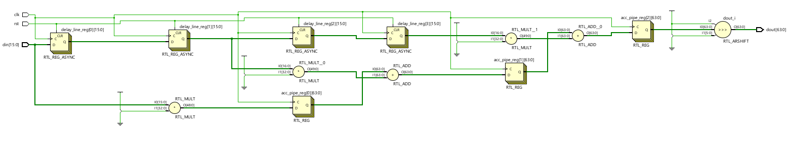 |
|:--:|
| *Figure 5: Simplified version of filter with 3 coefficients* |

### Vivado Setup
All analysis was done using Xilinx Vivado. Each filter has its own project, but the Source setup is relatively the same. Unless specified, the project includes one top sv file, one data input file, and one testbench file. This is shown below for the pipelined FIR filter.

| 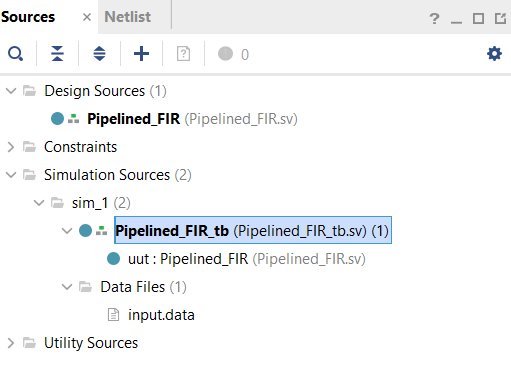 |
|:--:|
| *Figure 6: Vivado RTL project sources* |

### Behavioral Simulation
We first confirm functionality of the filter using the simulation. As shown below in Figure 7, we see the same oscillation in the pass band as in the MATLAB filter. Then, we see a sharp cutoff region as the logarithmically increasing frequency of din becomes too high.

|  |
|:--:|
| *Figure 7: Vivado simulation results* |

### Timing Analysis
Next, we perform timing analysis to find the critical path. We can generate the shortest path by running `report_timing -max_paths 1 -path_type full -delay_type max` in the tcl console. This produces the below output.

    Timing Report

    Slack (MET) :             21170.736ns  (required time - arrival time)
    Source:                 acc_pipe_reg[101][58]/C
                                (rising edge-triggered cell FDRE clocked by clk  {rise@0.000ns fall@10638.000ns period=21276.000ns})
    Destination:            dout[27]
                                (output port clocked by clk  {rise@0.000ns fall@10638.000ns period=21276.000ns})
    Path Group:             clk
    Path Type:              Max at Slow Process Corner
    Requirement:            21276.000ns  (clk rise@21276.000ns - clk rise@0.000ns)
    Data Path Delay:        3.154ns  (logic 1.110ns (35.187%)  route 2.044ns (64.813%))
    Logic Levels:           1  (OBUF=1)
    Output Delay:           100.000ns
    Clock Path Skew:        -2.077ns (DCD - SCD + CPR)
        Destination Clock Delay (DCD):    0.000ns = ( 21276.000 - 21276.000 ) 
        Source Clock Delay      (SCD):    2.077ns
        Clock Pessimism Removal (CPR):    0.000ns
    Clock Uncertainty:      0.035ns  ((TSJ^2 + TIJ^2)^1/2 + DJ) / 2 + PE
        Total System Jitter     (TSJ):    0.071ns
        Total Input Jitter      (TIJ):    0.000ns
        Discrete Jitter          (DJ):    0.000ns
       Phase Error              (PE):    0.000ns
    -------------------------------------------------------------------    -------------------
                         (clock clk rise edge)    21276.000 21276.000 r  
                         propagated clock network latency
                                                      0.000 21276.000    
                         clock pessimism              0.000 21276.000    
                         clock uncertainty           -0.035 21275.965    
                         output delay              -100.000 21175.965    
    -------------------------------------------------------------------
                         required time                      21175.965    
                         arrival time                          -5.230    
    -------------------------------------------------------------------
                         slack                              21170.736

We can again observe:
1. Most of the delay comes from the path, not the logic.
2. The high slack indicates that the clock could run much faster.

We can also find the approximate worst logic delay for the circuit by generating a timing report with the following below command, which searches to find 10,000 paths with the worst setup time. We can then sort the table to find the highest logic delay as shown below.

 `report_timing_summary -delay_type max -report_unconstrained -check_timing_verbose -max_paths 10000 -input_pins -routable_nets -name timing_1`

| 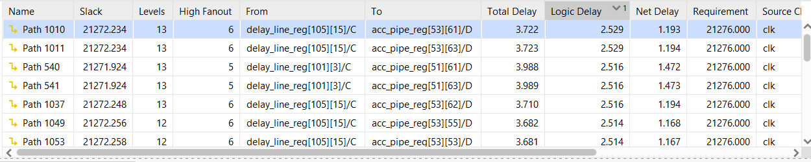 |
|:--:|
| *Figure 8: Highest logic delay in schematic* |

| 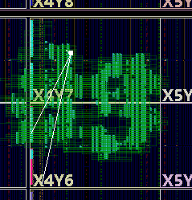 |
|:--:|
| *Figure 9: Critical path on device (white)* |

### Utilization and Power
Next, we run implementation. Doing this grants access to utilization and power characteristics, which are shown below.

| 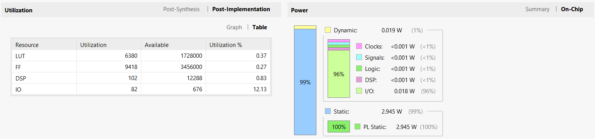 |
|:--:|
| *Figure 10: Post-implementation utilization and power* |

## Two-Parallel FIR Filter
### Design
To design the Two-Parallel FIR filter, I followed the diagram provided in Parhi's slides [1]. Since there is no pipelining, this is a more simple process. Parallel FIR filters use poly-phase decomposition, and I highly recommend the reader view Parhi's slides for a quick discussion on H1, H2, and any other aspects of this filter that could be confusing. Additionally, this design is a "fast" version, meaning that the filter has been reformulated to minimize the number of operations required.
| 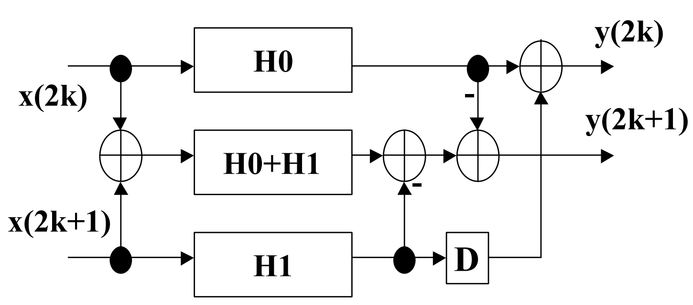 |
|:--:|
| *Figure 11: Two-Parallel FIR diagram [1]* |

### Behavioral Simulation
Again, the simulation results match MATLAB.
|  |
|:--:|
| *Figure 12: Vivado simulation results* |

### Timing Analysis
We again perform timing analysis to determine the critical path.

    Timing Report

    Slack (MET) :             21152.850ns  (required time - arrival time)
    Source:                 buffer2_reg[19][11]/C
                                (rising edge-triggered cell FDCE clocked by clk  {rise@0.000ns fall@10638.000ns period=21276.000ns})
    Destination:            dout2[62]
                                (output port clocked by clk  {rise@0.000ns fall@10638.000ns period=21276.000ns})
    Path Group:             clk
    Path Type:              Max at Slow Process Corner
    Requirement:            21276.000ns  (clk rise@21276.000ns - clk rise@0.000ns)
    Data Path Delay:        20.274ns  (logic 5.720ns (28.212%)  route 14.555ns (71.788%))
    Logic Levels:           35  (CARRY8=14 DSP_A_B_DATA=1 DSP_ALU=1 DSP_M_DATA=1 DSP_MULTIPLIER=1 DSP_OUTPUT=1 DSP_PREADD_DATA=1 LUT3=8 LUT4=6 OBUF=1)
    Output Delay:           100.000ns
    Clock Path Skew:        -2.841ns (DCD - SCD + CPR)
        Destination Clock Delay (DCD):    0.000ns = ( 21276.000 - 21276.000 ) 
        Source Clock Delay      (SCD):    2.841ns
        Clock Pessimism Removal (CPR):    0.000ns
    Clock Uncertainty:      0.035ns  ((TSJ^2 + TIJ^2)^1/2 + DJ) / 2 + PE
        Total System Jitter     (TSJ):    0.071ns
        Total Input Jitter      (TIJ):    0.000ns
        Discrete Jitter          (DJ):    0.000ns
        Phase Error              (PE):    0.000ns
    < Omitted calculations >
    -------------------------------------------------------------------    -------------------

                            (clock clk rise edge)    21276.000 21276.000 r  
                            propagated clock network latency
                                                        0.000 21276.000    
                            clock pessimism              0.000 21276.000    
                            clock uncertainty           -0.035 21275.965    
                            output delay              -100.000 21175.965    
    -------------------------------------------------------------------
                            required time                      21175.965    
                            arrival time                         -23.115    
    -------------------------------------------------------------------
                            slack                              21152.850

We can again observe:
1. Most of the delay comes from the path, not the logic.
2. The high slack indicates that the clock could run much faster.

| 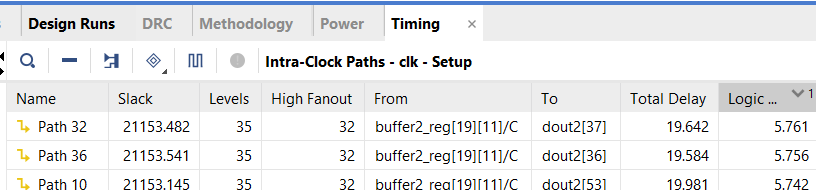 |
|:--:|
| *Figure 13: Logic delay* |

|  |
|:--:|
| *Figure 14: Critical path of circuit (white)* |

### Utilization and Power

|  |
|:--:|
| *Figure 15: Post-implementation utilization and power* |

## Three-Parallel FIR Filter
### Design
I again used Parhi's slides to make the Fast Three-Parallel FIR Filter.
| 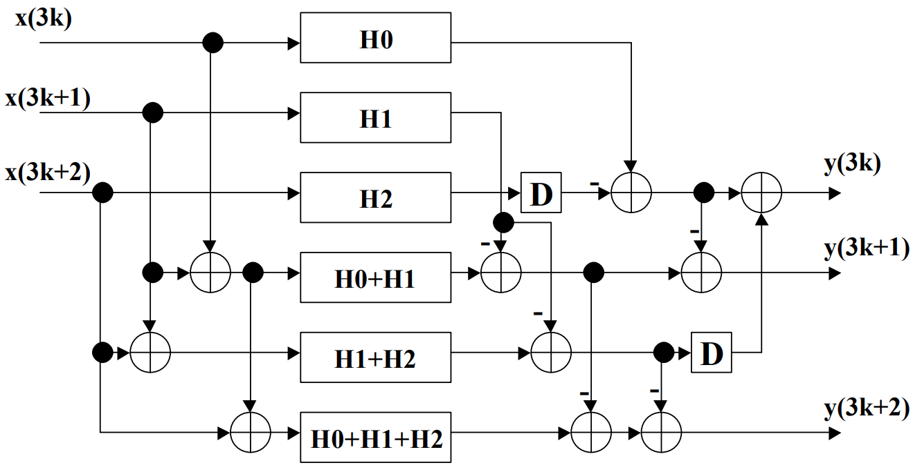 |
|:--:|
| *Figure 16: Two-Parallel FIR diagram [1]* |

### Behavioral Simulation
Again, the simulation results match MATLAB.
| 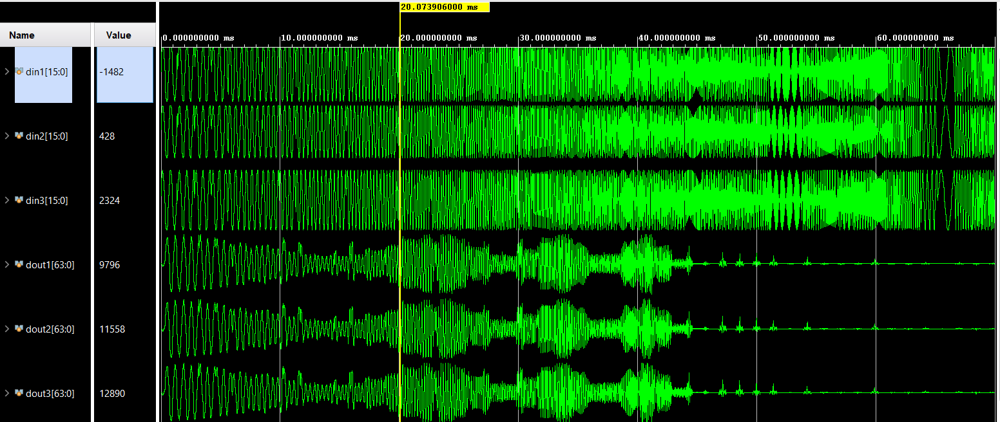 |
|:--:|
| *Figure 17: Vivado simulation results* |

### Timing Analysis
We again perform timing analysis to determine the critical path.

    Timing Report

    Slack (MET) :             21146.637ns  (required time - arrival time)
    Source:                 buffer1_reg[28][3]/C
                                (rising edge-triggered cell FDCE clocked by clk  {rise@0.000ns fall@10638.000ns period=21276.000ns})
    Destination:            dout3[53]
                                (output port clocked by clk  {rise@0.000ns fall@10638.000ns period=21276.000ns})
    Path Group:             clk
    Path Type:              Max at Slow Process Corner
    Requirement:            21276.000ns  (clk rise@21276.000ns - clk rise@0.000ns)
    Data Path Delay:        26.527ns  (logic 6.581ns (24.811%)  route 19.945ns (75.189%))
    Logic Levels:           41  (CARRY8=16 DSP_A_B_DATA=1 DSP_ALU=1 DSP_M_DATA=1 DSP_MULTIPLIER=1 DSP_OUTPUT=1 DSP_PREADD_DATA=1 LUT3=9 LUT4=5 LUT5=2 LUT6=2 OBUF=1)
    Output Delay:           100.000ns
    Clock Path Skew:        -2.803ns (DCD - SCD + CPR)
        Destination Clock Delay (DCD):    0.000ns
         = ( 21276.000 - 21276.000 ) 
        Source Clock Delay      (SCD):    2.803ns
        Clock Pessimism Removal (CPR):    0.000ns
    Clock Uncertainty:      0.035ns  ((TSJ^2 + TIJ^2)^1/2 + DJ) / 2 + PE
        Total System Jitter     (TSJ):    0.071ns
        Total Input Jitter      (TIJ):    0.000ns
        Discrete Jitter          (DJ):    0.000ns
        Phase Error              (PE):    0.000ns
    < Omitted calculations >
    -------------------------------------------------------------------    -------------------
                            (clock clk rise edge)    21276.000 21276.000 r  
                            propagated clock network latency
                                                         0.000 21276.000    
                            clock pessimism              0.000 21276.000    
                            clock uncertainty           -0.035 21275.965    
                            output delay              -100.000 21175.965    
    -------------------------------------------------------------------
                            required time                      21175.965    
                            arrival time                         -29.330    
    -------------------------------------------------------------------
                            slack                              21146.637

We can again observe:
1. Most of the delay comes from the path, not the logic.
2. The high slack indicates that the clock could run much faster.

We can again check the highest logical delay from the design.

| 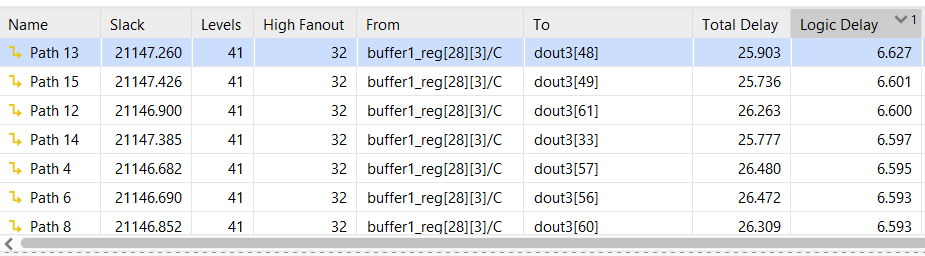 |
|:--:|
| *Figure 18: Logic delay* |

|  |
|:--:|
| *Figure 19: Critical path of circuit (orange)* |

### Utilization and Power

| 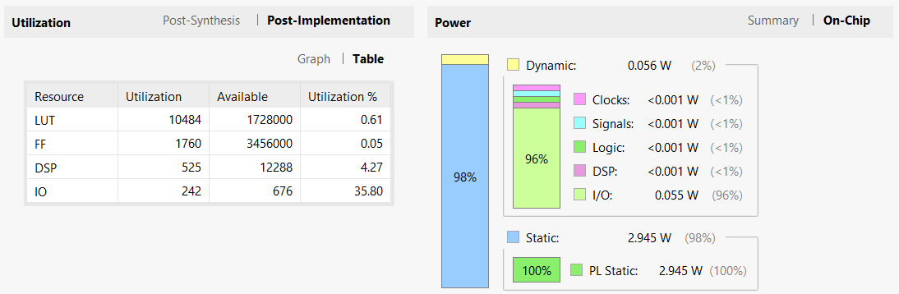 |
|:--:|
| *Figure 20: Post-implementation utilization and power* |

## Three-Parallel Pipelined FIR Filter
### Design
To build the three-parallel pipelined FIR filter, I simply duplicated the pipelined FIR filter 3 times. A more efficient approach could use something such as a pipelined fast FIR filter.

### Behavioral Simulation
Again, the simulation results match MATLAB.
| 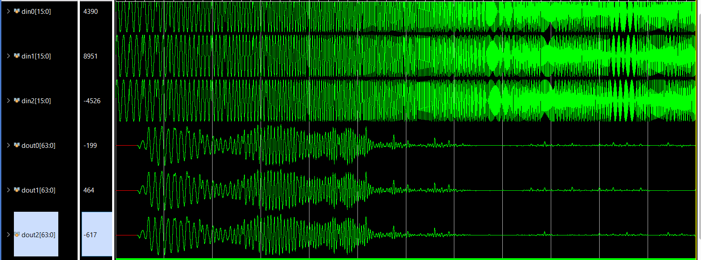 |
|:--:|
| *Figure 21: Vivado simulation results* |

### Timing Analysis
We again perform timing analysis to determine the critical path.

    Timing Report

    Slack (MET) :             21169.904ns  (required time - arrival time)
    Source:                 F2/acc_pipe_reg[101][53]/C
                                (rising edge-triggered cell FDRE clocked by clk  {rise@0.000ns fall@10638.000ns period=21276.000ns})
    Destination:            dout2[22]
                                (output port clocked by clk  {rise@0.000ns fall@10638.000ns period=21276.000ns})
    Path Group:             clk
    Path Type:              Max at Slow Process Corner
    Requirement:            21276.000ns  (clk rise@21276.000ns - clk rise@0.000ns)
    Data Path Delay:        3.092ns  (logic 1.081ns (34.953%)  route 2.011ns (65.047%))
    Logic Levels:           1  (OBUF=1)
    Output Delay:           100.000ns
    Clock Path Skew:        -2.969ns (DCD - SCD + CPR)
        Destination Clock Delay (DCD):    0.000ns = ( 21276.000 - 21276.000 ) 
        Source Clock Delay      (SCD):    2.969ns
        Clock Pessimism Removal (CPR):    0.000ns
    Clock Uncertainty:      0.035ns  ((TSJ^2 + TIJ^2)^1/2 + DJ) / 2 + PE
        Total System Jitter     (TSJ):    0.071ns
        Total Input Jitter      (TIJ):    0.000ns
        Discrete Jitter          (DJ):    0.000ns
        Phase Error              (PE):    0.000ns
    < Omitted calculations >
    -------------------------------------------------------------------    -------------------
                            (clock clk rise edge)    21276.000 21276.000 r  
                            propagated clock network latency
                                                        0.000 21276.000    
                            clock pessimism              0.000 21276.000    
                            clock uncertainty           -0.035 21275.965    
                            output delay              -100.000 21175.965    
    -------------------------------------------------------------------
                            required time                      21175.965    
                            arrival time                          -6.060    
    -------------------------------------------------------------------
                            slack                              21169.904  

We can again observe:
1. Most of the delay comes from the path, not the logic.
2. The high slack indicates that the clock could run much faster.

We can again check the highest logical delay from the design. This time, we again see that the highest critical path is what we expect: one adder and one multiplier between the delay buffer and the pipeline.

| 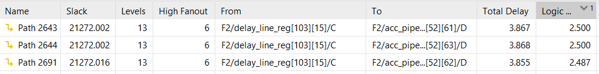 |
|:--:|
| *Figure 22: Logic delay* |

| 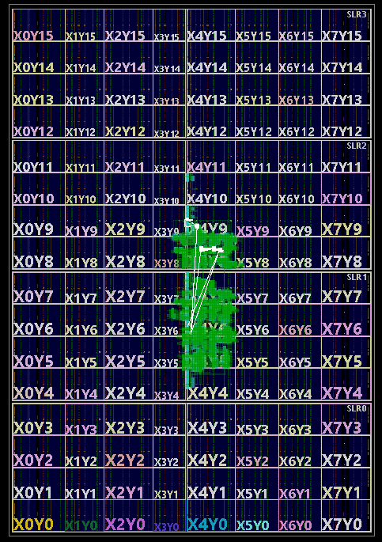 |
|:--:|
| *Figure 23: Critical path of circuit (white)* |

### Utilization and Power

| 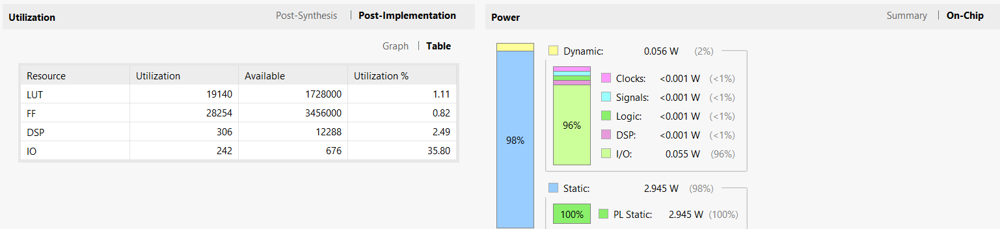 |
|:--:|
| *Figure 24: Post-implementation utilization and power* |

## Conclusions
| Filter Type                | Slack (ns)  | Logic Delay (ns) | LUT Cells | FF Cells | DSP Cells | IO Cells | Total Cells | Dynamic Power (W) | Static Power (W) |
|:--------------------------:|:-----------:|:----------------:|:---------:|:--------:|:---------:|:--------:|:-----------:|:-----------------:|:----------------:|
| Pipelined                  | 21170.736   | 2.529            | 6380      | 9418     | 102       | 82       | 15982       | 0.019             | 2.945            |
| Two-Parallel               | 21152.850   | 5.761            | 5378      | 1696     | 153       | 162      | 7390        | 0.037             | 2.945            |
| Three-Parallel             | 21146.637   | 6.627            | 10484     | 1760     | 525       | 242      | 13011       | 0.056             | 2.945            |
| Three-Parallel Pipelined   | 21169.904   | 2.500            | 19140     | 28254    | 306       | 242      | 47942       | 0.056             | 2.945            |

1. Three-Parallel Pipelined is the absolute best choice for performance. It has the highest output per cycle (3) and the lowest logic delay (2.5). This means it could have both the highest theoretical clock speed and output per cycle.
2. Three-Parallel Pipelined costs the most, in terms of cells. Therefore, if high clock speed is not desirable, the optimal design is Three-Parallel.
3. All implementations had the same amount of static power usage and thus overall power usage. I believe that the static power number is due to all four being based on a board which dwarfs the actual resources needed. If a smaller board was used, I would expect the static power usage to be lower and varied amongst the implementations.
4. The dynamic power appears to be equivalent to 0.019 W * (the number of outputs). This is another design trade-off.

## Future Work
- Using 64 bits prevented overflow, but is definitely overkill. Area and power usage could be significantly reduced by reducing the extra bits allocated for pipeline calculations.
- To reduce the "ripple" in the passband, more filter taps could be added.
- Using a pipelined fast three-parallel FIR filter would be more effective than my implementation, which instead is comprised of three regular pipelined FIR filters.
- The leftmost cut in my pipelined FIR filter is unneeded, and could be removed.
- A smaller, more efficient FPGA board could have been chosen. This is especially relevant since in the highest slack paths, around 75% of latency was caused by signal propagation time, not logic delay.

## References
[1] https://people.ece.umn.edu/users/parhi/SLIDES/chap9.pdf
